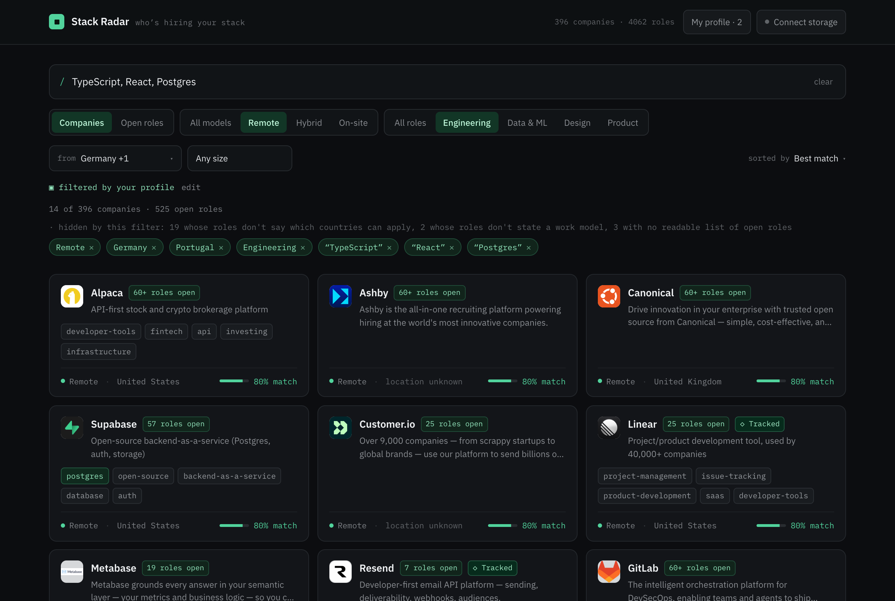
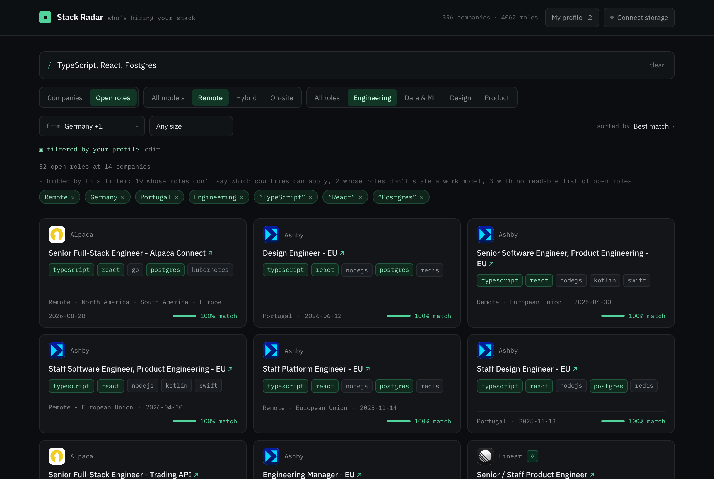
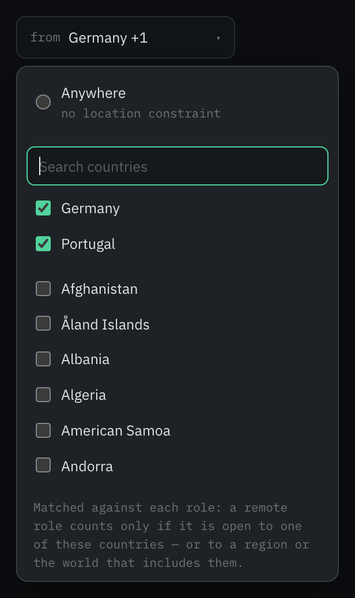
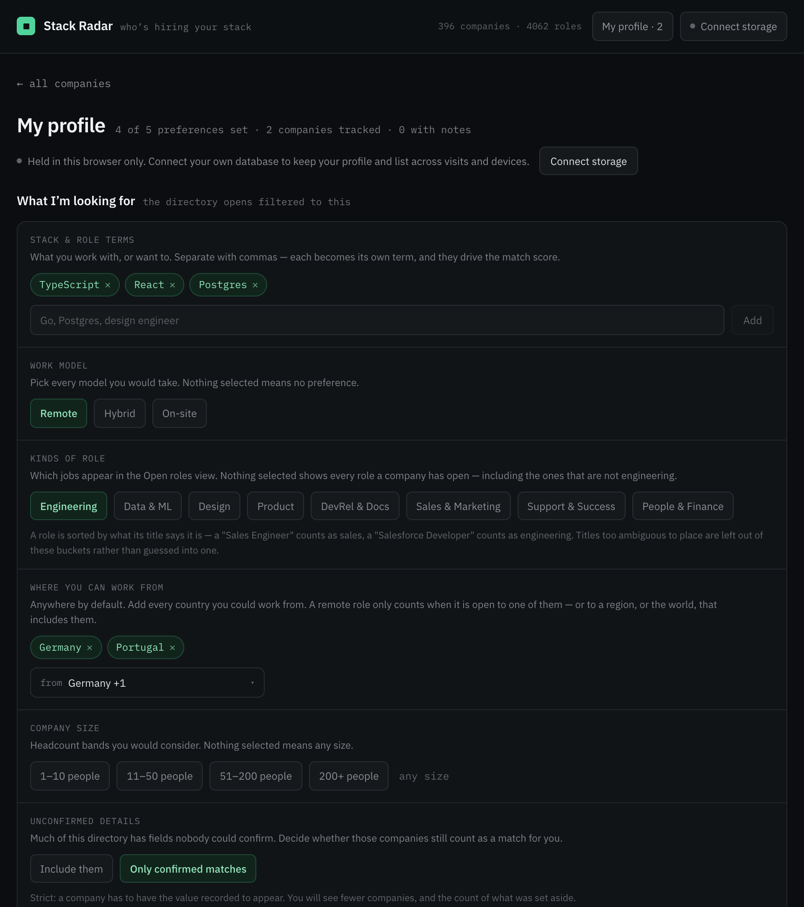
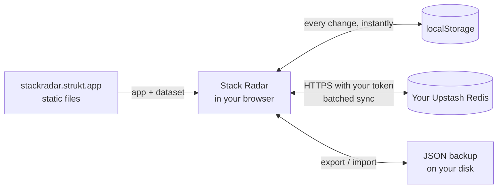
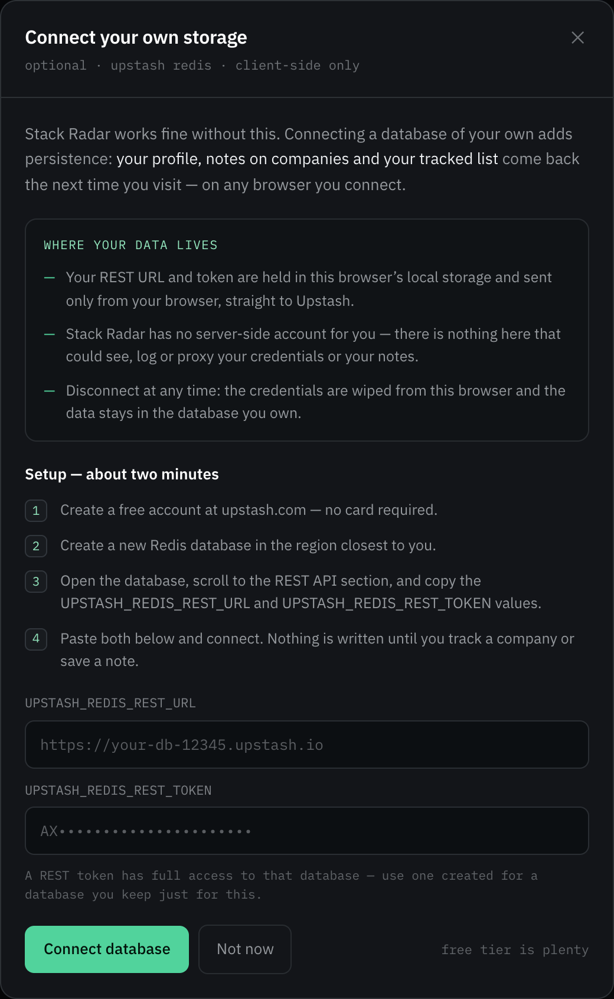
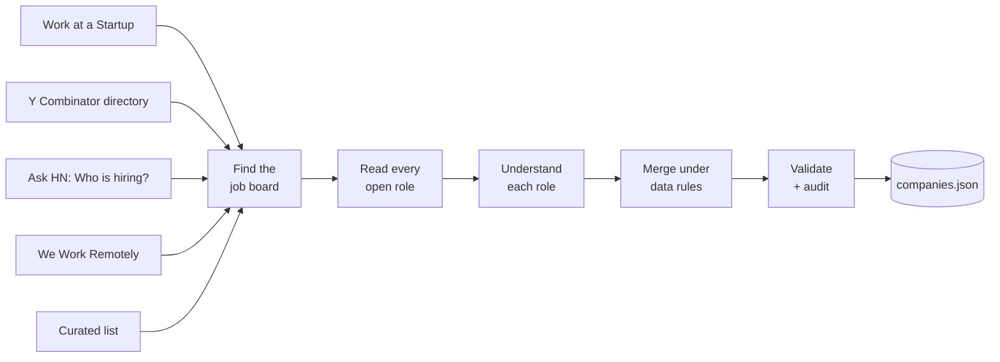

<div align="center">

<a href="https://stackradar.strukt.app">
  
</a>

<h1>Stack Radar</h1>

<p><strong>Who's hiring your stack.</strong></p>

<p>
  A searchable directory of tech companies and the roles they have open —<br>
  read from each company's own job board, and matched to where you can actually work from.
</p>

<p>
  <a href="https://stackradar.strukt.app"></a>
  <a href="LICENSE"></a>
  
  
  
  
  
</p>

<p>
  <a href="https://stackradar.strukt.app"><strong>Open the app</strong></a> ·
  <a href="#features">Features</a> ·
  <a href="#your-data-your-storage">Storage</a> ·
  <a href="#how-the-data-is-gathered">Data pipeline</a> ·
  <a href="#use-the-data">Use the data</a> ·
  <a href="#getting-started">Development</a>
</p>

</div>

<br>

<a href="https://stackradar.strukt.app">
  
</a>

<br>
<br>

<div align="center">

| 396 | 4,062 | 4,058 | 5 | 10 | 257 |
| :---: | :---: | :---: | :---: | :---: | :---: |
| companies | open roles | linked to the exact posting | discovery sources | job-board integrations | countries you can filter by |

<sub>Counted at the latest data refresh. The live figures are on the <a href="https://stackradar.strukt.app/data">sources &amp; method</a> page.</sub>

</div>

## What is Stack Radar?

Stack Radar maps tech companies — mostly startups and mid-size teams, many of them hiring
remotely — and reads the roles they have open straight from their own job boards. Tell it the
stack you work with and where you can work from, and it answers two questions: **which companies
should I know about**, and **which of their roles could I actually take**. Every result carries
a match score, every role links to its exact posting, and every company shows when it was last
checked.

Behind the app is an open dataset — one static JSON file — assembled by a pipeline that treats
a missing value as fine and a wrong one as a bug.

## Features

### Search by stack

Type what you work with: `TypeScript, Postgres, design engineer`. Each comma-separated term is
matched as a whole, so `go` finds Go roles rather than Ridango or Algolia, and `design engineer`
finds design-engineering roles rather than every company that mentions "engineer" somewhere.

A company is scored on where each term appears — its name, its keywords, the technologies
detected in its open roles, their titles, its description — and the result is a **0–100 match
score** with its reasons one hover away. The same scorer runs in the app, the API and the MCP
server, so a 68% means the same thing everywhere.

### Two views of one search



**Companies** answers *who should I know about*. **Open roles** answers *which jobs fit me* —
one card per role, ranked by the same match score, linking straight to the posting and to the
company's page. Switch between them at any time; the search stays exactly as it was.

| Filter | Options |
| --- | --- |
| **Work model** | Remote · Hybrid · On-site — pick any combination |
| **Role type** | Engineering · Data & ML · Design · Product |
| **Location** | Anywhere, or any set of countries you can work from |
| **Company size** | 1–10 · 11–50 · 51–200 · 200+ people |
| **Sort** | Best match · Most open roles · Recently verified · Company name |

Every filter lives in the URL, so a search is a link you can share — and coming back from a
company page lands you exactly where you left off.

### Location means *where you can work from*



A remote role open only to US residents is no use to someone in Lisbon, however remote it is.
So location isn't matched against a company's head office — it's matched against **each role's
own stated availability**. Pick *Anywhere*, or every country you could work from.

Work model and location are then evaluated **together, per role**: a company matches only when
one of its roles satisfies both. That matters — of 1,847 roles that say remote, only 89 are
open worldwide; the rest are tied to a country or a region, and the filter knows which.

A plain "Remote" that never says who may apply is shown as *not confirmed* rather than read as
"anywhere", and an office city on its own is never taken as evidence that a role is remote.

<br clear="right">

The pipeline reads every posting's location into how and where the job can be done:

| The posting says | Stack Radar reads |
| --- | --- |
| `Remote - US` | remote · United States |
| `Home based - EMEA` | remote · Europe, Middle East & Africa |
| `Remote - Nordics` | remote · Denmark, Finland, Iceland, Norway, Sweden |
| `Hybrid - Berlin` | hybrid · Germany |
| `Anywhere in the world` | remote · worldwide |
| `Remote` | remote · *not stated where* |

It understands 257 countries, 8 regions (Worldwide, Europe, EMEA, Americas, North America,
Latin America, South America, APAC), groupings like DACH, Benelux and the Baltics, US states,
Canadian provinces and a table of common cities.

### Role types, read from the title

Every role is classified into one of eight kinds — Engineering, Data & ML, Design, Product,
DevRel & Docs, Sales & Marketing, Support & Success, People & Finance. The rules look for the
non-engineering signal first, so a *Sales Engineer* is sales and a *Salesforce Developer* is
engineering. A title too ambiguous to place stays out of every bucket rather than being guessed
into one.

### Your profile



Say what you're looking for once — stack terms, work models, kinds of role, where you can work
from, company sizes, and whether unconfirmed details should still count. **The directory opens
filtered to your profile** and every card shows how well it matches. Change a filter and you're
exploring: the profile stays as it was until you edit it.

### Tracking, notes and hiring history

- **Track companies** through six statuses — Tracked, Applied, Waiting response, Interviewing,
  Offer, Not hired — shown as badges across the directory.
- **Keep notes** on any company, right on its page.
- **See hiring over time.** Every refresh appends a weekly point per company — how many roles
  were open and which technologies they asked for — and the company page charts it.

### Honest about what isn't known

`null` is a first-class value here. Size, location and work model are genuinely unknown for
part of the index, and the app says so instead of guessing. When a filter sets companies aside
for missing data, it **counts them and says why**:

> *hidden by this filter: 13 whose roles don't say which countries can apply, 2 whose roles
> don't state a work model*

Your profile decides whether those still count as matches. And every company shows when it was
last checked against its own job board: *verified*, *stale* after 14 days, or *never checked*.

## Your data, your storage

Stack Radar has no accounts and no sign-up. Your profile, tracked companies and notes belong to
you, and you choose where they live:

| | This browser | Your Upstash Redis | JSON file |
| --- | :---: | :---: | :---: |
| **Setup** | none — it's the default | paste a URL and token, ~2 min | one click |
| **Follows you across devices** | — | ✓ | by hand |
| **Survives clearing site data** | — | ✓ | ✓ |
| **Held by** | your browser | your database | you |





- **Local first.** Every change is written to the browser immediately, so everything works with
  no database at all — and keeps working if one becomes unreachable.
- **Straight to your database.** Once connected, the browser talks directly to your Upstash
  REST endpoint. Your credentials and notes go from your browser to your database and nowhere
  else.
- **Guard-railed credentials.** The REST URL must be `https` on an `*.upstash.io` host, so a
  mistyped or pasted URL can never send your token somewhere unexpected. Storage keys are
  namespaced and validated.
- **Quiet sync.** Edits are batched and written shortly after you stop typing.
- **Merges, never clobbers.** Connecting a second browser unions both sides, so nothing tracked
  on either is lost — and a fresh browser picks up the profile already saved in your database.
- **Failure you can see and fix.** If a sync fails, the header turns to *Storage error*, your
  changes stay safe in the browser, and the storage dialog offers **Retry** and an in-place
  **credential update**. A failed update leaves the previous connection exactly as it was.
- **Leave any time.** Disconnecting wipes the credentials from the browser; the data stays in
  the database you own.
- **Portable backups.** Export everything as JSON — the same shape that's stored locally and in
  Redis — and import it anywhere. An import shows what the file holds before changing anything,
  then merges: the file wins where both sides have a value, and nothing is deleted.

<br clear="right">

## How the data is gathered

The dataset is built by a local pipeline in [`scripts/update/`](scripts/update). Deterministic
scripts do the fetching, parsing, merging and validating; [Claude Code](https://claude.com/claude-code)
does the research that needs reading and judgement.



### 1 · Discover companies — five sources

| Source | What it finds |
| --- | --- |
| **Work at a Startup** | YC startups hiring engineers today — website, team size, per-posting links |
| **Y Combinator directory** | every YC-funded company, hiring or not, with headcount and remote flags |
| **Hacker News** | remote-friendly startups from the monthly *"Ask HN: Who is hiring?"* thread |
| **We Work Remotely** | remote-first companies, from the RSS category feeds |
| **Curated list** | hand-picked companies for ecosystems with no machine-readable directory, including all Estonian coverage |

Each source contributes a company's **name and its own domain**. The roles always come from the
company itself.

### 2 · Read the job board — ten integrations

Ashby · Greenhouse · Lever · Workable · Personio · Recruitee · SmartRecruiters · BambooHR ·
Teamtailor · YC's Work at a Startup

Boards are read through their public APIs, which is what lets **4,058 of 4,062 roles link to
the exact posting** rather than a careers page you then have to search. Up to 60 roles are kept
per company, and a board at that ceiling shows **60+ roles open** rather than passing a sample
off as the whole list.

### 3 · Understand each role

Every posting is enriched on the way in: the **technologies** it mentions, its **work model and
where it's open to** (parsed into slots like `{ "mode": "remote", "where": ["europe"] }`), its
**role type**, and its **posting date**. A work model is recorded only when the posting states
it.

### 4 · Merge under data rules

The merge layer in [`merge.mjs`](scripts/update/lib/merge.mjs) enforces the rules every write
goes through:

- **A failed scan changes nothing.** An unreachable careers page is indistinguishable from a
  company that stopped hiring, so the record keeps its previous state — including its
  `lastVerified` date, which the UI then shows ageing.
- **The company's own word wins.** A fact read from a company's own site outranks one from a
  directory listing; listings only fill blanks. When a merge declines a field, it says which
  and why.
- **History is append-only**, keyed on the ISO week, so re-running a refresh updates the week
  instead of duplicating it.
- **One country, one spelling.** Every country passes through a normaliser, so `US`, `USA` and
  `United States of America` are the same place and `EMEA` is never mistaken for a country.

### 5 · Research the gaps

For what no API can answer — headcount, headquarters, work policy — `enrich` writes a task list,
Claude Code researches each company **on its own site**, and `apply` validates every finding
against a fixed allow-list of fields, types and ranges before merging. Enrichment can fill in a
record but never create one. [`RESEARCH-NOTES.md`](scripts/update/RESEARCH-NOTES.md) keeps what
each round learned, dead ends included, and [`SOURCES.md`](scripts/update/SOURCES.md) documents
every verified endpoint and the traps already found.

### 6 · Validate, audit, ship

`validate:data` checks the JSON Schema and the dataset's invariants — an unverified company
can't claim openings, history can't exist without a verification date. `audit:data` goes further
and looks for data that is *wrong* rather than merely malformed. Then a commit and push
redeploys the site.

## Use the data

The whole dataset is one static file — no key, no rate limit:

```bash
curl https://stackradar.strukt.app/companies.json
```

<details>
<summary><strong>What a record looks like</strong> (abridged)</summary>

```jsonc
{
  "id": "resend",
  "name": "Resend",
  "description": "Developer-first email API platform — sending, deliverability, webhooks, audiences.",
  "website": "https://resend.com",
  "linkedinUrl": "https://www.linkedin.com/company/resend",
  "sizeMin": 45,
  "sizeMax": 45,
  "country": "United States",
  "remotePolicy": "remote",
  "keywords": ["email", "developer-tools", "api", "webhooks", "deliverability"],
  "currentOpenings": [
    {
      "title": "Product Engineer",
      "url": "https://jobs.ashbyhq.com/resend/9b68ba51-3895-4d29-8fd1-364bdf8956e7",
      "postedDate": "2026-06-03",
      "detectedKeywords": ["typescript", "react", "nextjs"],
      "location": "Americas · Europe",
      "workplace": [
        { "mode": "remote", "where": ["americas"] },
        { "mode": "remote", "where": ["europe"] }
      ]
    }
  ],
  "history": [{ "weekOf": "2026-09-14", "openCount": 6, "keywordCounts": { "typescript": 2, "go": 1 } }],
  "lastVerified": "2026-09-17T19:28:08.193Z",
  "dataNotes": "…"
}
```

Fields nobody could confirm are `null`. An empty `where` means the posting didn't say, which is
never the same as `"worldwide"`. The full shape is in
[`data/companies.schema.json`](data/companies.schema.json).

</details>

**For agents and LLMs**

- [`/llms.txt`](https://stackradar.strukt.app/llms.txt) describes the site and the dataset for
  language models.
- An **MCP server** in [`mcp/`](mcp) lets an assistant query the directory as a tool:

  | Tool | Returns |
  | --- | --- |
  | `search_companies` | companies ranked by match, each with its score and reasons |
  | `get_company` | the full record, including every open role and the weekly history |
  | `list_open_positions` | every open role across the dataset, filterable |

  ```bash
  claude mcp add stack-radar -- node /path/to/stackradar/mcp/dist/index.js
  ```

- A filtered, ranked **JSON API** is built into [`api/`](api) and can be switched on when
  deploying — see [Deploying](#deploying).

## Under the hood

- **A static site with a dataset at its core.** `data/companies.json` is the single source of
  truth. The React app bundles it at build time, and every company page — plus the methodology
  page — is **prerendered to static HTML** with its own title and description.
- **One implementation of every rule.** Relevance scoring ([`scoring.ts`](src/lib/scoring.ts)),
  filtering ([`filtering.ts`](src/lib/filtering.ts)), the location vocabulary
  ([`regions.ts`](src/lib/regions.ts)) and role classification
  ([`discipline.ts`](src/lib/discipline.ts)) are shared by the app, the API and the MCP server,
  so a query ranks the same wherever it's asked.
- **Safe by construction.** Search input is split and scanned by hand, never compiled into a
  regular expression, which keeps ReDoS off the table.

```text
data/companies.json          the dataset — single source of truth
data/companies.schema.json   its JSON Schema
src/                         the React app
src/lib/                     scoring, filtering, regions, discipline — shared everywhere
scripts/update/              the data pipeline: sources, job-board adapters, merge rules
scripts/validate-data.mjs    schema + invariants
scripts/audit-data.mjs       checks for data that is wrong, not just malformed
api/                         serverless JSON API
mcp/                         MCP server
```

**Built with** Vite 7 · React 19 · TypeScript (strict, `exactOptionalPropertyTypes`) ·
Tailwind CSS v4 with OKLCH design tokens · React Router · Zod · IBM Plex, self-hosted.

## Security and privacy

- **Your data stays yours.** It lives in your browser, or in a database you own and connect
  directly — see [storage](#your-data-your-storage).
- **Served from one origin.** Fonts are self-hosted and company logos are stored in the repo,
  so reading the directory loads everything from this site.
- **Strict Content Security Policy** (`script-src 'self'`, no inline scripts), plus `nosniff`,
  `frame-ancestors 'none'`, HSTS and a restrictive `Permissions-Policy`.
- **Every external link is validated** before it reaches an `href` — only `http(s)` passes — and
  carries `rel="noopener noreferrer"`.

## Getting started

Requires Node.js 20+ and pnpm.

```bash
pnpm install
pnpm dev        # http://localhost:5173
pnpm verify     # validate data → typecheck → lint → build
```

| Command | What it does |
| --- | --- |
| `pnpm validate:data` | JSON Schema plus the dataset's invariants |
| `pnpm audit:data` | looks for data that is *wrong* rather than merely malformed |
| `pnpm audit:data:live` | the same, plus probing a sample of posting URLs |
| `pnpm data:status` | coverage counts |
| `pnpm data:gaps` | what's missing, grouped by *why* |

### Running the pipeline

```bash
node scripts/update/cli.mjs status               # where the data stands
node scripts/update/cli.mjs discover             # find new companies from every source
node scripts/update/cli.mjs refresh --limit 150  # scan job boards, update roles and history
node scripts/update/cli.mjs enrich               # write out the gaps that need research
node scripts/update/cli.mjs apply --file r.json  # validate and merge researched findings
node scripts/update/cli.mjs logos                # fetch and store logos locally
node scripts/update/cli.mjs linkedin             # find each company's own LinkedIn link
node scripts/update/cli.mjs workplace            # re-derive every role's workplace, offline
```

Every command is a dry run until `--write`, and every write backs up the previous
`companies.json` first. In Claude Code, `/refresh-data` runs the whole loop.

## Deploying

A static build plus optional serverless functions. On Vercel it needs nothing beyond the
committed `vercel.json`. To deploy under another domain, repoint the absolute URLs:

```bash
pnpm set-site-url https://your-deployment.example
cd mcp && npm run build      # so the bundled default updates too
```

<details>
<summary><strong>Switching on the JSON API</strong></summary>

<br>

`api/` serves `/api/companies`, `/api/companies/{id}`, `/api/search` and `/api/positions`,
plus a docs page. It is typechecked and linted with the rest of the project and ships switched
off, since one static file serves the app well at this size.

1. Remove the `api/` line from `.vercelignore`
2. Add the API typecheck back into `build`:
   `... && tsc -b && tsc -p api/tsconfig.json --noEmit && vite build && ...`
3. Restore the endpoint list in `public/llms.txt`
4. Optionally set `STACK_RADAR_API` for the MCP server, so it prefers live data over its bundled
   snapshot

</details>

## License

The code is [MIT](LICENSE) licensed.

The dataset is assembled from companies' own public job boards and websites, and each record
carries its provenance — `lastVerified`, `dataNotes`, and a `null` wherever nothing was
established. Use it freely; please keep the nulls null.
